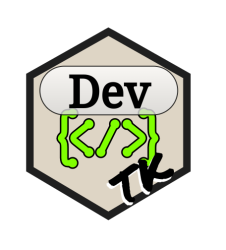

<!-- README.md is generated from README.Rmd. Please edit that file -->

```{r, include = FALSE}
knitr::opts_chunk$set(
  collapse = TRUE,
  comment = "#>",
  fig.path = "man/figures/README-",
  out.width = "100%"
)
```

# DevTK <a href='https://nchanard.github.io/DevTK/'></a>

<!-- badges: start -->
[](https://github.com/NChanard/DevTK/actions/workflows/R-CMD-check.yaml)
[](https://app.codecov.io/gh/NChanard/DevTK?branch=master)
<!-- badges: end -->

DevTK is a set of programming tools  

## Installation

You can install the development version of DevTK from [GitHub](https://github.com/) with:

``` r
remotes::install_github("NChanard/DevTK")
```

## Documentation  

[DevTK](https://nchanard.github.io/DevTK/)
